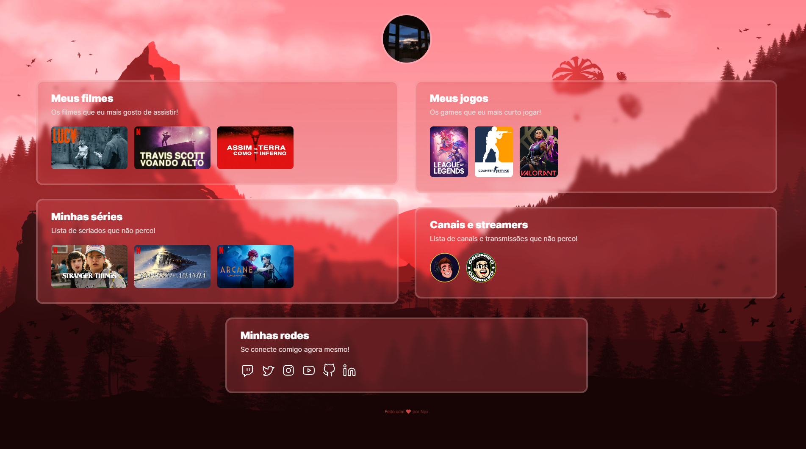

<h1 align="center">
  ☁ NLW Cloud
</h1>

  

## 🚀 Tecnologias

Esse projeto foi desenvolvido com as seguintes tecnologias:

- HTML
- CSS

## 💻 Projeto

NLW Cloud é a junção dos projetos NLW eSports e NLW Flix em um só, desenvolvidos durante a **[Next Level Week eSports](https://nextlevelweek.com/)**.

Você pode visualizar o projeto em funcionamento através do link abaixo:

- **[NLW Cloud](https://nlwcloud.vercel.app/)**

## 🔖 Layout

Você pode visualizar o layout do projeto através [desse link](https://www.figma.com/file/iZIO042nGjO8CihmfR49BA/NLW-eSports---Explorer/duplicate). É necessário ter conta no [Figma](https://figma.com) para acessá-lo.

---

Este projeto foi desenvolvido durante a **[Next Level Week eSports](https://nextlevelweek.com/)**, realizada pela **[@Rocketseat 💜](https://github.com/Rocketseat)**.
